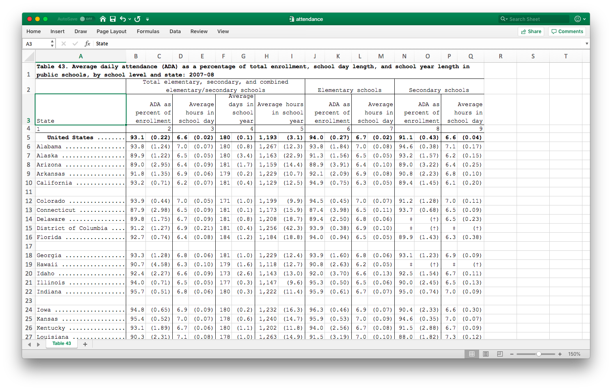
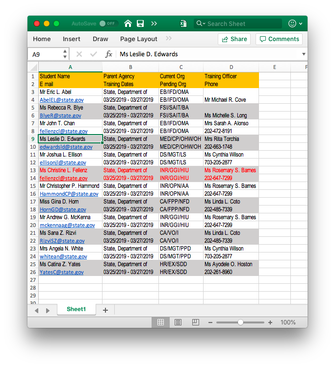

```{r setup, include=FALSE}
knitr::opts_chunk$set(echo = TRUE, comment = '')
library(rio)
```

layout: true

<div class="my-header">
<span>PS 312, March 2019</span></div>

---
class: middle, center

# Tidy data

---

# Make the computer happy

Just as we want code to make humans happy, we want data to make computers happy

Tidy data is a principle promoted by Dr. Hadley Wickham to make computers happy

--

The properties of a tidy dataset are:

1. Each variable forms a column
1. Each observation forms a row
1. Each type of observational unit forms a table. 

This forms a standardized way to structure a dataset, and so makes it easy for the 
analyst to develop standard pipelines. 

---
class: center, middle

## A tidy dataset is tidy in one way, but a messy dataset can be messy in many ways

<span style='text-align:right;font-size:30pt;'>Hadley Wickham</span>

---

# Messy data

A dataset can be messy in many many ways. Many of the more common issues are listed below:

- Column names contain values, not just variable names
- Multiple variables are stored in one column
- Variables are stored in both rows and columns
- Multiple types of observational types are stored in the same table
- A single observational unit is stored in multiple tables

Sometimes the messier format is better for data entry, but bad for data analyses. 


---

# Variables in column names

```{r, message = F, warning = F}
library(tidyverse)
pew <- import('Data/FSI/pew.csv')
head(pew, 4)
```

- This dataset has actual data in the column headers, rather than variable names. 
- We should ideally have 3 columns in this dataset: religion, income and frequency. 
- We can achieve this using a function called `gather` which takes a wide dataset and makes it tall. 

---

.left-column[
- Gather all the columns into two columns, `income` and `frequency`, by stacking the columns
- Don't include the variable `religion`
]
.right-column[
```{r, eval=T}
pew %>% 
  gather(income, frequency, -religion) %>%
  as_tibble()
```
]

---

.pull-left[
```{r}
head(pew)
```
]
.pull-right[
```{r}
pew %>% 
  gather(income, frequency, -religion) %>% head(20)
```

]

---

# Multiple variables in column names

```{r}
tb <- import('Data/FSI/tb.csv') %>% as_tibble()
head(tb)
```

- column headers include both sex and age

---

```{r}
tb %>% 
  gather(sex_age, n, -iso2, -year, -fu)


```

---

```{r}
tb %>% 
  gather(sex_age, n, -iso2, -year, -fu, na.rm=T)


```

---

```{r}
tb %>% 
  gather(sex_age, n, -iso2, -year, -fu, na.rm=T) %>% 
  separate(sex_age, c('sex','age'), sep=1) # by position

```

This still needs to be cleaned

---

# Variables stored in rows and columns

```{r}
weather <- import('Data/FSI/weather.csv') %>% as_tibble()
weather
```

---

```{r}
weather %>% 
  gather(day, temp, d1:d31) #<<
```

`d1:d31` denotes all the variables physically between `d1` and `d31` in the dataset

> See what happens when you type `1:10` in the console

---

```{r}
weather %>% 
  gather(date, temp, d1:d31) %>% 
  spread(element, temp) #<<
```

---
class: middle, center

# Data cleaning

---

```{r}
weather %>% 
  gather(date, temp, d1:d31) %>% 
  spread(element, temp) 
```

- date column in alphabetical rather than numerical order

---

```{r}
weather %>% 
  gather(date, temp, d1:d31) %>% 
  spread(element, temp) %>% 
  mutate(date = parse_number(date)) #<<
```

---

```{r}
weather %>% 
  gather(date, temp, d1:d31) %>% 
  spread(element, temp) %>% 
  mutate(date = parse_number(date)) %>% 
  arrange(date) #<<
```

Not quite! We'd like dates ordered within months

---

```{r}
weather %>% 
  gather(date, temp, d1:d31) %>% 
  spread(element, temp) %>% 
  mutate(date = parse_number(date)) %>% 
  arrange(month, date) #<<
```
--
Good. Now to save it

```{r,eval = F}
weather2 <- weather %>% 
  gather(date, temp, d1:d31) %>% 
  spread(element, temp) %>% 
  mutate(date = parse_number(date)) %>% 
  arrange(month, date)
```

---

# Exercise

The file `Data/FSI/mbta.xlsx` contains monthly data on number of commuter trips by different modalities on the MBTA system n Boston. 

- It is in a messy format. 
- It also has an additional quirk in that it has a title on the first line that 
isn't even data. You can avoid loading that in by using the option `skip=1` (i.e. skip the first line) when you
import. 

Work through this process to clean this dataset into tidy form. I'll also note that you can "minus" columns by 
position as well as name, so `gather(date, avg_trips, -1, -mode)` is valid to not involve the first column and the `mode` column. 

---

```{r, echo = T, message=F}
mbta <- import('Data/FSI/mbta.xlsx', skip = 1) %>% as_tibble()
mbta2 <- mbta %>% 
  gather(date, avg_trips, -1, -mode) %>% 
  separate(date, c("year", "month"), sep = '-')
mbta2
```
--
- `year`, `month`, `avg_trips` are all character variables
- There is an odd column named `..1`
- The rows with "All Modes by Qtr" and "TOTAL" aren't necessary

---

```{r}
mbta2 %>% 
  mutate(
    year = parse_number(year),
    month = parse_number(month),
    avg_trips = parse_number(avg_trips)
  )
```

---

```{r}
mbta2 %>% 
  mutate(
    year = parse_number(year),
    month = parse_number(month),
    avg_trips = parse_number(avg_trips)
  ) %>% 
  select(-1) #<<
```

---

```{r}
mbta2 %>% 
  mutate(
    year = parse_number(year),
    month = parse_number(month),
    avg_trips = parse_number(avg_trips)
  ) %>% 
  select(-1) %>% 
  filter(mode != 'TOTAL', mode != "All Modes by Qtr") #<<
```

---

# Other cleaning tasks

1. `distinct()` keeps the unique (non-duplicate) rows of a dataset. Usage: `dataset %>% distinct()`
1. If you want to keep only rows with complete data, you can invoke `drop_na`. Usage: `dataset %>% drop_na()`. You 
can modify `drop_na` by specifying variables from which you want to drop the missing values. 
1. If you want to convert a value to missing (commonly 99 is used for missing data), then you can use `replace_na` within `mutate` to change to missing values on a column-by-column basis. Usage: `dataset %>% mutate(var1 = na_if(var1, 99))`

---
class: middle, center

# Cleaning Excel data

---

# Excel is used as a visual medium

- Tables created to look good rather than being tidy or computer-friendly
  - Color being used to denote values of some variables
  - Multiple lines of headers
  - Multiple rows with variables
  - Typos leading to numeric variables become character
  
---

# Excel is not reproducible, prone to mistakes by click

- Two special cases of Excel errors in the press
  - Duke cancer scandal with Dr. Anil Potti's group
  - Reinhart & Rogoff models for economic growth

- 35% of datasets in Nature (the journal) have Excel errors (The Economist, 2016)

> A gene named `1MAR` is entered in Excel. What does it become?

---



---

.left-column[
- Real data lies in the paired statistics and standard error columns
- The headers are basically different groupings and categories and should be variables

]
.right-column[

]

---

.left-column[
- `import` fails horribly
- Two packages, `tidyxl` and `unpivotr`, by Duncan Garmonsway, save the day
]
.right-column[

]

---

```{r, warning=F}
library(tidyxl)
dataset1 <- xlsx_cells('Data/FSI/attendance.xlsx')
dataset1
```

- This grabs a bunch of meta-data about the Excel entries, including color and formatting features
- The data has been blown up on a cell-by-cell basis
- Use `tidyverse` tools to fix this? Nope. `unpivotr` is more powerful in this case.

---

```{r, message = F}
library(unpivotr)
dataset1 %>% 
  filter(row != 1, row != 4, row < 65) %>% 
  behead('N', tophead) %>% 
  behead('N', head2) %>% 
  behead('W', State) %>% 
  select(row, col, data_type, numeric, tophead, head2, State)
```

- Pull off the two headers first with `behead`. Tell the function what direction (N, W, S, E or angles)
the header is sitting in relation to the data
- Pull off the first column with states, which is a "header" on the left
- Show relevant columns

---

```{r, message = F}
library(unpivotr)
dataset1 %>% 
  filter(row != 1, row != 4, row < 65) %>% 
  behead('N', tophead) %>% 
  behead('N', head2) %>% 
  behead('W', State) %>% 
  select(row, col, data_type, numeric, tophead, head2, State) %>% 
  mutate(header = ifelse(col %% 2 == 0, 'stats','se'))
```

- even columns are stats, odd columns are standard errors
- `%%` gives the remainder when left side is divided by right side

---

```{r, message = F}
library(unpivotr)
dataset1 %>% 
  filter(row != 1, row != 4, row < 65) %>% 
  behead('N', tophead) %>% 
  behead('N', head2) %>% 
  behead('W', State) %>% 
  select(row, col, data_type, numeric, tophead, head2, State) %>% 
  mutate(header = ifelse(col %% 2 == 0, 'stats','se')) %>% 
  fill(tophead) %>% fill(head2)
```

- column headers spanned several columns visually, but rested in left-most column internally
- used _last value carried forward_ to fill in the other columns
---

```{r, message = F}
library(unpivotr)
tidy_dataset <- dataset1 %>% 
  filter(row != 1, row != 4, row < 65) %>% 
  behead('N', tophead) %>% 
  behead('N', head2) %>% 
  behead('W', State) %>% 
  select(row, col, data_type, numeric, tophead, head2, State) %>% 
  mutate(header = ifelse(col %% 2 == 0, 'stats','se')) %>% 
  fill(tophead) %>% fill(head2) %>% 
  select(-col) %>% 
  spatter(header, numeric) %>% #<<
  select(-row)
tidy_dataset
```

- `spatter` works like `spread`, but is more robust for this kind of weird data

---

```{r, message = F}
tidy_dataset <- tidy_dataset %>% 
  mutate(State = str_remove(State, '\\.+')) %>% #<<
  mutate(State = str_trim(State))
tidy_dataset
```

- We're using a __regular expression__ to identify and remove all the dots
  - Rich tool for text searching
- Next we trim away any white space that is around the string

---

# Save the data

```{r}
saveRDS(tidy_dataset, file = 'Data/FSI/schools.rds')
```

The RDS format is an open standard and a fast way to store and retrieve datasets in R

---
class: middle, center

# What about being colorful?

---

.pull-left[
```{r}
library(tidyxl)
library(unpivotr)

dataset2 <- xlsx_cells('Data/FSI/classlist.xlsx')
formats <- xlsx_formats('Data/FSI/classlist.xlsx')
```

We need to grab the formats too, now

```{r}
format_id <- dataset2$local_format_id
dataset2$font_color <- formats$local$font$color$rgb[format_id]
dataset2$bg_color <- formats$local$fill$patternFill$fgColor$rgb[format_id]

unique(dataset2$font_color)
unique(dataset2$bg_color)

```


]
.pull-right[

]

---

# Grab the red rows


```{r}
red_rows <- dataset2 %>% filter(font_color=='FFFF0000') %>% 
  select(row, col, data_type, character) %>% 
  mutate(row=2, col = 1:8)
headers <- dataset2 %>% filter(bg_color == 'FFFFC000') %>% 
  select(row, col, data_type, character) %>% 
  mutate(row = 1, col = 1:8)

bind_rows(headers, red_rows) %>% 
  behead('N', header) %>% 
  select(-col) %>% 
  spatter(header) %>% 
  select(-row)
```

---

# Tidying this data

.pull-left[
There are really two datasets interwoven here

- The odd rows form one dataset
- The even rows form another dataset

We need to put these two datasets side-by-side
]
.pull-right[

]

---

# Tidying this data

.pull-left[
```{r}
dat1 <- dataset2 %>% 
  filter( row %% 2 == 1) %>% # odd rows
  behead('N', header) %>% 
  mutate(row = (row+1)/2) # make the row numbers sequential

dat2 <- dataset2 %>% 
  filter(row %% 2 == 0) %>%  # even rows
  behead('N', header) %>% 
  mutate(row = row/2) %>% # make row numbers sequential
  mutate(col = col+4) # These will be the last 4 cols of new data

tidy_dataset2 <- 
  rbind(dat1, dat2) %>% # Put datsets on top of each other
  select(row, data_type, numeric, character, header) %>% 
  spatter(header) %>% 
  select(-row, -numeric)

```

]
.pull-right[

]

---

# Tidying this data

.pull-left[
```{r}
dat1 <- dataset2 %>% 
  filter( row %% 2 == 1) %>% # odd rows
  behead('N', header) %>% 
  mutate(row = (row+1)/2) # make the row numbers sequential

dat2 <- dataset2 %>% 
  filter(row %% 2 == 0) %>%  # even rows
  behead('N', header) %>% 
  mutate(row = row/2) %>% # make row numbers sequential
  mutate(col = col+4) # These will be the last 4 cols of new data

tidy_dataset2 <- 
  rbind(dat1, dat2) %>% # Put datsets on top of each other
  select(row, data_type, numeric, character, header) %>% 
  spatter(header) %>% 
  select(-row, -numeric)

```

]
.pull-right[
```{r, echo=F}
tidy_dataset2
```
]

---

# Tidying this data

```{r}
tidy_dataset2 <- tidy_dataset2 %>% 
  set_names(make.names(names(.))) %>%  #<<
  select(Student.Name, everything())
```

```{r, echo=F}
tidy_dataset2
```

