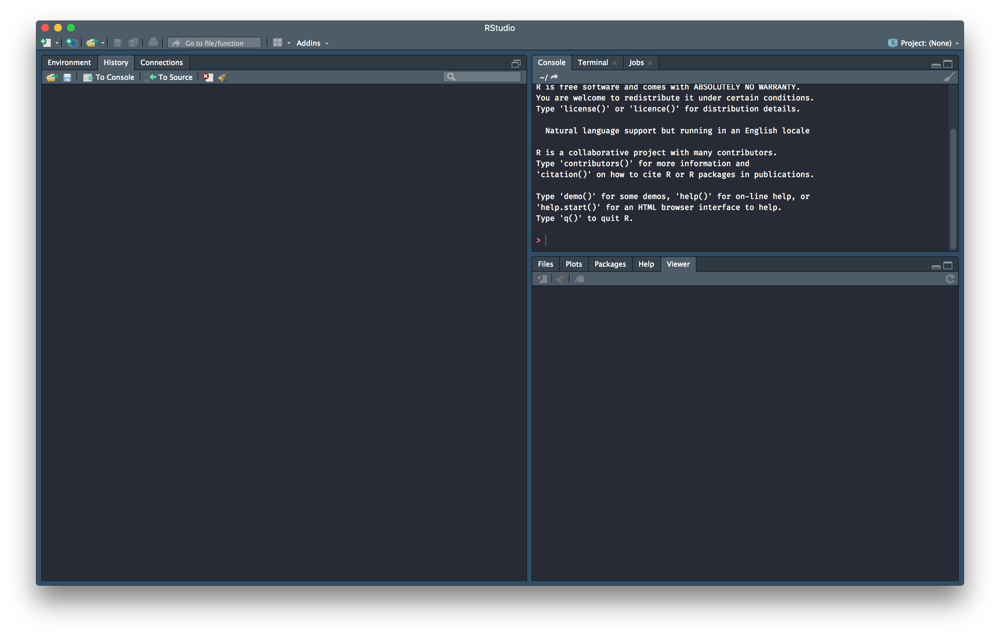
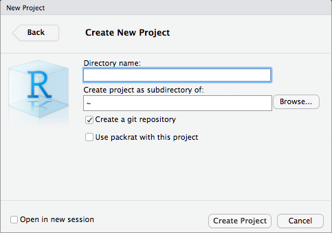

```{r setup, include=FALSE}
knitr::opts_chunk$set(echo = FALSE)
```

layout: true

<div class="my-header">
<span>PS 312, March 2019</span></div>

---

# RStudio




---

# RStudio

Important panels are

1. Script panel
1. Console panel
1. Files panel

You will also use these panels at some point this week

1. Plots panel
1. Viewer panel
1. Help panel

---
class: invert, middle, center

# Live Demo

---

# RStudio Projects

- Encapsulate each project in a RStudio Project
  - `File > New Project`
- This keeps the R instances from different projects separate
  - No cross-contamination
- This automatically puts you in the right working directory

---

# RStudio Projects

.pull-left[

]
.pull-right[
- You can actually pull from an existing Git repository directly
- One way I have a copy of projects on different computers
- May not be allowable at DOS
]
---

# RStudio Projects

.pull-left[

]
.pull-right[
- Many different choices and templates
- I've got a bunch of stuff installed. You might not see so many choices
]
---

# RStudio Projects

.pull-left[

]
.pull-right[
- You can start a Git repository for version control if you like
- `packrat` is a way of fixing the versions of R packages you'll use for the project. Helps with future reproducibility
]
