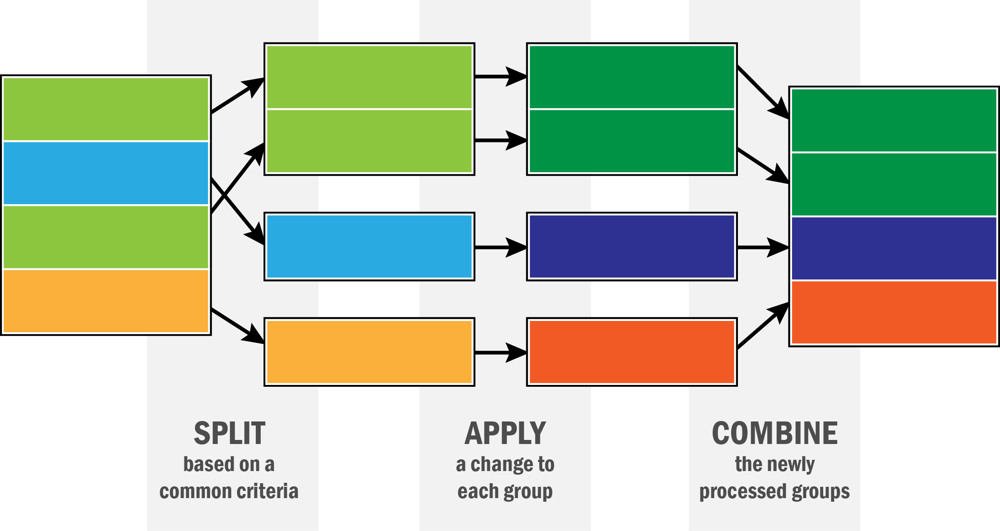

```{r setup, include=FALSE}
knitr::opts_chunk$set(echo = TRUE, comment = "")
library(rio)
library(tidyverse)
```

layout: true

<div class="my-header">
<span>PS 312, March 2019</span></div>

---
class: middle, center, inverse

# Welcome to Day 2


---

# More about `select`

`select` selects variables from your dataset. 

__Usage__: dataset %>% select(variable names)

```{r}
library(rio)
dos <- import('Data/FSI/Department of State.csv') %>% as_tibble()
# names(dos)
```

This data set has variables in various groups by name.

---

# More about `select`

.left-column30[
```{r, eval=F}
dos %>% 
  select(starts_with("Award"))
```
]
.right-column30[
```{r, echo=F}
dos %>% select(starts_with("Award"))
```

]
---

# More about `select`

.left-column30[
```{r, eval=F}
dos %>% 
  select(ends_with("Value"))
```
]
.right-column30[
```{r, echo=F}
dos %>% select(ends_with("Value"))
```

]
---

# More about `select`

.left-column30[
```{r, eval=F}
dos %>% 
  select(contains("Transaction"))
```
]
.right-column30[
```{r, echo=F}
dos %>% select(contains("Transaction"))
```

]

---

# `select` helpers

- starts_with(): Starts with a prefix.
- ends_with(): Ends with a suffix.
- contains(): Contains a literal string.
- matches(): Matches a regular expression.
- num_range(): Matches a numerical range like x01, x02, x03.
- one_of(): Matches variable names in a character vector.
- everything(): Matches all variables.
- last_col(): Select last variable, possibly with an offset.

---

# Dates

```{r}
start_dates <-  dos %>% 
  select(ends_with("Date")) %>% 
  select(contains("Start")) %>% 
  pull(1)
  
head(start_dates)
```

Let's work a bit with dates

Cheatsheet: [https://rawgit.com/rstudio/cheatsheets/master/lubridate.pdf](https://rawgit.com/rstudio/cheatsheets/master/lubridate.pdf)

---

# Dates

```{r}
library(lubridate)
start_dates <- as_date(start_dates) %>% head()
start_dates
year(start_dates)
month(start_dates)
day(start_dates)
```

---

# Dates

```{r}
sort(start_dates)
quarter(start_dates)
days(start_dates) - days(as_date('2011-10-01')) # Days from start of fiscal year
```

---
class: middle, center

# Joins

---


---

# Some simulated data

We simulated 2 datasets
- real estate allocation at DOS by Bureau
- staffing at DOS by Bureau

We want to see what the average area per person is across DOS

```{r}
staffing_data <- import('Data/FSI/Staffing_by_Bureau.csv')
real_estate <- import('Data/FSI/DoS_Real_Estate_Allocation.csv')
```

---

```{r}
staffing_data %>% as_tibble()
real_estate %>% as_tibble()
```

---

```{r, message=T}
staff_summary <- staffing_data %>% 
  group_by(Bureau) %>% 
  tally(name = 'Pop')
realestate_summary <- real_estate %>% 
 group_by(Bureau) %>% summarize(Size = sum(Size))
```
```{r}
staff_summary %>% head(4)
realestate_summary %>% head(4)
```

---

```{r}
staff_summary %>% 
  inner_join(realestate_summary, by = c("Bureau" = "Bureau"))
```

---

```{r}
staff_summary %>% 
  inner_join(realestate_summary, by = c("Bureau" = "Bureau")) %>% 
  mutate(unit_area = Size/Pop) %>% 
  arrange(unit_area)

```

---
class: middle, center

# Summarizing data

---

# The `dplyr` package

This gives us 5 verbs for single data frames:

- `filter`: filter a dataset by rows
- `select`: select columns of a dataset
- `arrange`: arrange rows of a dataset by values of some variables
- `group_by`: split a dataset by values of some variables, so that we can apply verbs to each split
- `summarize`: compute various summaries from the data

---

# The `dplyr` package

.pull-left[
Gives us verbs for joining 2 data frames:

- `left_join`
- `right_join`
- `inner_join`
- `outer_join`
- `semi_join`
- `anti_join`
- `bind_rows`
- `bind_cols`
]
.pull-right[
The joins are different ways to merge two data sets which have at least one variable in common

The `semi-join` and `anti-join` are really filters rather than joins

The last two just put data frames together as long as they conform in dimension
]

---

```{r}
library(tidyverse)
mtcars1 <- mtcars %>% rownames_to_column('cars') %>% as_tibble()
mtcars1
```
--

```{r}
mtcars1 %>% summarize(mpg = mean(mpg, na.rm=T), disp = mean(disp, na.rm=T), hp = mean(hp, na.rm=T))
```

---

# Scoped verbs

All the `dplyr` verbs have scoped versions `*_all`, `*_at` and `*_if`.

.left-column30[
1. `*_all` : Act on all columns
1.  `*_at`  : Act on specified columns
1.  `*_if`  : Act on columns with specific property
]
.right-column30[
```{r}
dos %>% mutate_at(vars(ends_with("Date")), as_date) %>% 
  summarise_if(is.Date, max)
```
```{r}
dos %>% mutate_at(vars(ends_with("Date")), as_date) %>% 
  summarize_at(vars(ends_with("Date")), ~max(., na.rm=T))
```
]
---

# Factors (categorical variables)

`factor` types of variables are discrete or categorical variables, that only take
a small set of values. Think number of cylinders in a car, race, sex. 

```{r}
mtcars1 <- mtcars1 %>% 
  mutate_at(vars(cyl, vs, am, gear, carb), as.factor)
str(mtcars1)
```

---

# Means of numeric variables

```{r}
mtcars1 %>% summarize_if(is.numeric, mean)
```


---

# Summarize the variables

```{r}
summary(mtcars1)
```

---
class: middle, center


# Split-Apply-Combine

---



---

# Grouped summaries

```{r}
mtcars1 %>% 
  group_by(cyl) %>% 
  summarize(mpg_mean = mean(mpg))
```

---

# Grouped summaries
```{r}
mtcars1 %>% 
  group_by(cyl) %>% 
  summarize_if(is.numeric, mean)
```

---

# Grouped summaries

```{r}
mtcars1 %>% 
  group_by(cyl) %>% 
  summarize_if(is.numeric, list('mean' = mean, 'median' = median))
```

---

# Foreign aid (DOS)

```{r}
dos %>% 
  group_by(Implementing_Organization) %>% 
  summarize(amt = sum(Award_Transaction_Value)) %>% 
  arrange(desc(amt))
```

---
# Foreign aid (DOS)

```{r}
dos %>% 
  group_by(Implementing_Organization_Type) %>% 
  summarize(amt = sum(Award_Transaction_Value)) %>% 
  arrange(desc(amt))
```

---
# Foreign aid (DOS)

```{r}
dos %>% 
  group_by(Implementing_Organization, year = year(as_date(Award_Start_Date))) %>% 
  summarize(amt = sum(Award_Transaction_Value)) %>% 
  filter(Implementing_Organization != '', !is.na(year)) 
```

Save this as `dos_by_year`.

```{r, echo=F}
dos_by_year <- dos %>% 
  group_by(Implementing_Organization, year = year(as_date(Award_Start_Date))) %>% 
  summarize(amt = sum(Award_Transaction_Value)) %>% 
  filter(Implementing_Organization != '', !is.na(year)) 
```

---
# Foreign aid (DOS)

```{r}
dos_by_year %>% 
  group_by(year) %>% 
  summarize(amt = sum(amt))
```

