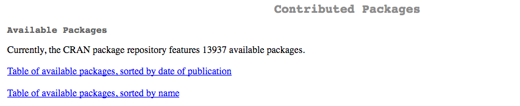
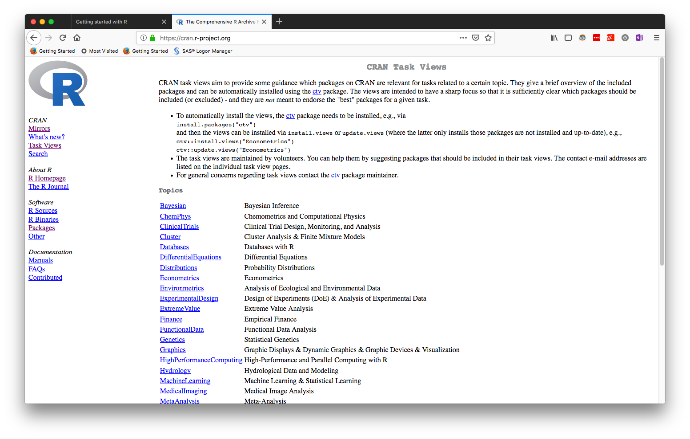
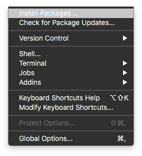
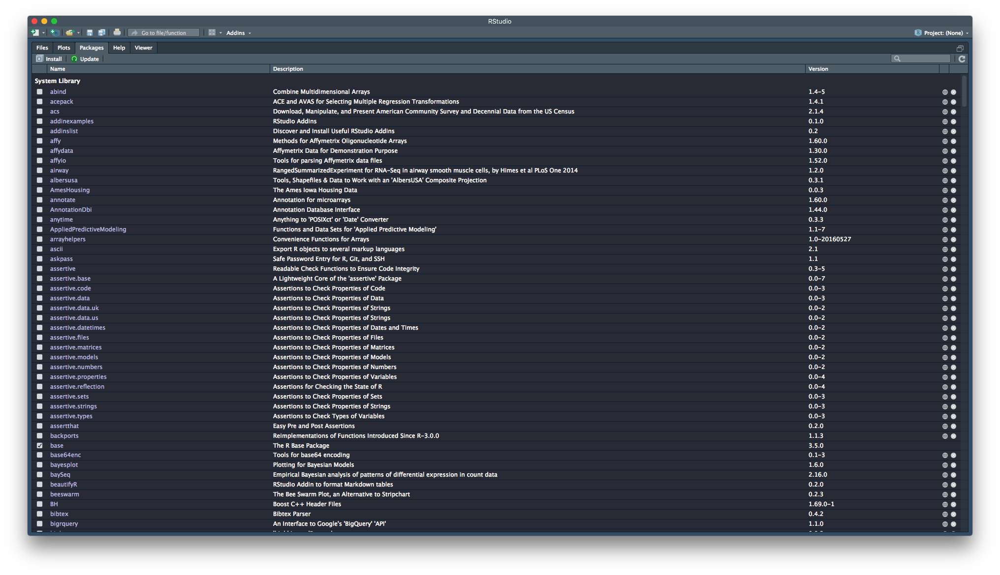
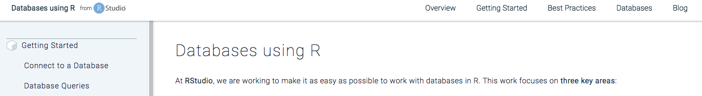

```{r setup, include=FALSE}
knitr::opts_chunk$set(echo = TRUE)
```

layout: true

<div class="my-header">
<span>PS 312, March 2019</span></div>

---
class: middle, center

# R is a language

---

# A programming language

- You learn and use languages to communicate with people and cultures
  - French, Farsi, Korean, Hindi, Swahili
- A programming language is a __language__ first and foremost
  - Meant to communicate with a computer
  - Has logical structure
  - Is typically precise (since computers are literal)
- R is a _programming language_ meant to interface with data
  - Domain Specific Language
  
---

# R has a grammar

- __Objects__: These are the _nouns_. We will act on objects to create new objects. Each object has a _name_ which we will treat as the nouns in our code.
- __Functions__: These are the _verbs_. Functions will act on objects to create new objects.
- __The ` %>% ` operator__: This acts like the conjunction "then" to create "sentences" called _pipes_ or _chains_.
- __Optional function arguments__: These are adverbs which modify the action of the function (verb).

> Start with an object (noun), successively act upon it with functions (verbs) to 
create another object (noun) that is useful to you in some way.

---

# R is modular

- R has a base set of functions that you install
- You add on to this with other modules called _packages_ to enhance functionality
- After you've installed a package, you have to activate it when you need it with a function called `library`

```{r, echo = F}
pkgs <- paste0('package:',tidyverse::tidyverse_packages())
for(p in pkgs){
  if (p %in% search()){
    detach(p, character.only=T)
  }
}
```

--

```{r, warning=F}
library(tidyverse)
```

---

# R is case-sensitive

Humans can read this:

> Aoccdrnig to a rscheearch at Cmabrigde Uinervtisy, it deosn't mttaer in waht oredr the ltteers in a wrod are, the olny iprmoatnt tihng is taht the frist and lsat ltteers be at the rghit pclae. The rset can be a toatl mses and you can sitll raed it wouthit porbelm. Tihs is bcuseae the huamn mnid deos not raed ervey lteter by istlef, but the wrod as a wlohe.

Computers cannot!!

--

Computers are extremely literal

---

# R is case-sensitive

- Spelling and case matter
- White space doesn't matter
- R doesn't have a signal to end a statement (C and Java have `;`)
  - Bit more forgiving

---
class: middle, center

# Let's see some code

---

```{r}
library(tidyverse)

mtcars1 <- mtcars %>% as_tibble() %>% rownames_to_column(var = 'cars')
head(mtcars1,5)
cars_summary <- mtcars1 %>% 
  group_by(cyl) %>% 
  summarize(mpg = mean(mpg)) %>% 
  arrange(desc(mpg))
cars_summary
  
```


---

```{r, eval=F}
library(tidyverse)

mtcars1 <- mtcars %>% as_tibble() %>% rownames_to_column(var = 'cars')
```

- start with a noun (`mtcars`)
- apply a verb to it (`as_tibble`)
  - this creates a new noun
- apply a verb to the new noun (`rownames_to_columns`)
  - modify the verb by an optional argument (`var = 'cars'`)
  - this creates a new noun
- assign a name to this noun (`mtcars1`)

---

```{r,eval=F}
mtcars1
```

- Call an object (noun) to see it

---

```{r}
cars_summary <- mtcars1 %>% 
  group_by(cyl) %>% # split by levels of cyl
  summarize(mpg = mean(mpg)) %>% # compute the mean mpg at each level
  arrange(desc(mpg)) # re-arrange in descending order of mpg
cars_summary
```

- The actual arrangement doesn't matter as long as ` %>% ` is at the end
- Any text on a line beginning with `#` is ignored as a comment

--

### Try to make your code human-readable

- The functions here, from the `dplyr` package, are English-comprehensible
- Not all functions are, but this kind of attention to detail is very nice

---
class: middle,center

# Naming things

---

# Conventions

- A syntactically valid name consists of letters, numbers and the dot or underline characters and starts with a letter or the dot not followed by a number
- Don't use `$`, `@`, `|`, and math symbols as they have other uses
- Make your names expressive, but not complicated
  - Don't use `data1`, `model2`
  - Do use `staffing_data`, `linear_model_height`

--


- Remember, the next person to see your code will probably be you
  - You can't "phone a friend", since that friend is your past self
  - You'll be left scratching your head about what you wrote
  - Been there, done that.
  
---

# Conventions

- I like `pothole_case`, i.e. joining words with underscores
  - Traditionally you'd join with `.`, but this is more readable to me
- Some people like `CamelCase`
- You can make different objects just by changing case
  - `staffing_data`, `Staffing_data`, `Staffing_Data`,`StaffingData`,
  `staffing.data`, `staffing_Data` can all be unambiguously different objects
  - Create your own system to figure out how to name things

--

> Finding a good name is hard, but often worth the effort

---

# Writing code

- You want to create a "story" for the data using R
- Scripts make the story reproducible and verifiable and transferable to other data

--

- Your first scripts will be sloppy
- Think about the writer; lot's of things in the trash
- With practice, this will get smoother

---
class: center, middle

# R Objects


---

# Objects

- Everything in R is an object
- There are two broad classes of objects: data objects (nouns) and functions (verbs)

---

# Data Objects

- `data.frame` or `tibble`: These are rectangular data sets much like you would see in a spreadsheet
- `vector`: This is a 1-dimensional list of numbers or strings (words in the language sense), but all must be of the same kind (number or string)
- `matrix`: This is a 2-dimensional list of numbers or strings, once again all of the same type
- A single number or word
- `list`: This is a catch-all bucket. Each element of a list can be literally any valid R object. So they could be `tibble`'s, or functions, or matrices, and different elements can be of different types.

---

# Data objects

- Most objects we'll use in this workshop are going to be `data.frame` or `tibble` objects. 
  - In case you're wondering, they're basically the same thing, but `tibble`'s have some modest additional functionality 
- R comes with a bunch of built-in datasets stored as `data.frame`s. 

---
class: middle, center

# Data Frames

---

```{r}
as_tibble(mtcars)
```

- We have columns which are variable
- Rows are observations
- You can see what kind of variable each column is (in a `tibble`)

---

# Characteristics of data frames

```{r}
dim(mtcars)
rownames(mtcars)
names(mtcars)
```

---

# Characteristics of data frames

- Each of the calls on the previous slide produce _bona fide_ objects in R. 
- You can assign names to these objects to store them for future use.

```{r}
car_names <- rownames(mtcars)
```

---

# Extracting elements

Data frames act like matrices

```{r, eval=F}
mtcars[3, 4] # extracts from 3rd row, 4th column
```
```{r, eval=F}
mtcars[,4] # extracts 4th column
```

```{r, eval = F}
mtcars[3,] # extracts 3rd row
```

Each of these are, in turn, R objects, so you can assign names to them to store.

---

# Extracting elements

We can see the overall structure of the data frame

```{r}
str(mtcars)
```

- `data.frame` with 32 rows and 11 colums
- each column is a variable
- each variable is numeric

---

# Extracting elements by name

You can extract columns out by name in 3 ways

- `mtcars[,'mpg']` (matrix notation)
- `mtcars$mpg` (a shortcut, allows tab-completion)
- `mtcars[['mpg']]` (list notation)

A `data.frame` is really a `list`, so list extractions using `[[]]` work, either by 
index or by name.

--

The first and third options allow for extracting more than one column

```{r, eval=F}
mtcars[,c('mpg','hp')]
mtcars[[c('mpg','hp')]]
```

The `c()` function stands for _concatenate_, and creates vectors.

---

# Exercise

Fisher's iris dataset is in-built in R with the name `iris`.

1. Determine how many observations and variables are in the dataset
1. What are the variable names?
1. What are the row names?
1. Extract the sepal length and petal widths out and save them in new objects

---
class: middle,center

# R packages

---

# Packages

- The power of the R ecosystem comes from packages



CRAN is the Comprehensive R Archive Network, the central repository of R packages
- CRAN has strict software criteria and testing to ensure usability (though not correctness)
- Packages may also reside on Github, or other curated repositories like Bioconductor

---

# Finding packages



---

# Finding packages

- [R-Bloggers](http://www.r-bloggers.com)
- [Twitter #rstats](https://twitter.com/hashtag/rstats)
- [RSeek](http://r-seek.org)

---

# Installing R packages



```{r, eval=F}
install.packages(<package name>, repos='https://cran.rstudio.com')
```

You can set the default repository in RStudio using `Tools > Global Options`.

---

# Installing R packages

The Packages pane 



---

# Exercise

Install the `rio` package using any of the methods mentioned

---

# The `tidyverse` meta-package

Includes

- readr (reading data from text files)
- tidyr (Manipulation, pivoting)
- dplyr (summarize, aggregate, filter)
- ggplot2 (visualization)
- purrr (functions applied across data structures, meta-programming)
- stringr (string manipulation)
- forcats (categorical data)

---
class: middle, center

# Importing data

---

# Data

R can access data files from a wide variety of sources. These include

1. Text files (csv, tsv, fixed-width)
1. Microsoft Excel files
1. Microsoft Access databases
1. SQL-based databases (MySql, Postgresql, SQLite, Amazon Redshift)
1. Enterprise databases (SAP, Oracle)

---

# The `rio` package

The `rio` package wraps many other packages to make importing and exporting data easy

It is great for importing and exporting non-database files that sit either on your computer or on
the internet

Importing the data will create an object called a data.frame, but if you
just import data, it is not saved since it doesn't yet have a name.

```{r, eval = F}
library(rio) # activate the package
import('data/HR_Data.csv') # can use single or double quotes
```

So every time you import data, you have to name it. You do this using the `<-` operator. 

```{r, echo = T}
library(rio)
hr_data <- import('data/HR_Data.csv')
```

---

# Checking out the data

```{r}
head(hr_data)
```

---

# Checking out the data

```{r, eval=F}
View(hr_data)
```


---

# Finer control of CSV imports

```{r}
hr_data <- import('data/HR_Data.csv', check.names = TRUE)
```

This ensures that the names of the variables are proper

```{r, eval = F}
hr_data <- import('data/HR_Data.csv', check.names = TRUE, dec = ',')
```
This allows European data to be correctly entered. 

---

# Finer control of Excel imports

You can specify sheet names or sheet positions for import from an Excel file. If you 
know the sheet name, you can specify it using the `which` option:

```{r}
dos_data <- import('data/simulatedDOS.xlsx', which='Staffing_by_Bureau')
```

You can also grab the same sheet by position:

```{r, eval = F}
dos_data <- import('data/simulatedDOS.xlsx', which = 2)
```

> See the help file for `import` by typing `?import` in the console or searching in the Help pane

---
class: center, middle

# Importing from databases

---

# Access databases

```{r, eval = F}
library(RODBC) # activate package, case-sensitive
channel <- odbcConnectAccess('C:/Documents/Name_of_Access_Database') # change to your
mydata <- sqlQuery(channel, paste("select * from Name_of_table_in_database"))
```

---

# SQL-based databases

```{r, eval = F}
library(odbc)
con <- dbConnect(odbc(),
                 Driver   = "[your driver's name]",
                 Server   = "[your server's path]",
                 Database = "[your database's name]",
                 UID      = rstudioapi::askForPassword("Database user"),
                 PWD      = rstudioapi::askForPassword("Database password"),
                 Port     = 1433)
```

and you can load a table into R using

```{r, eval = F}
dat <- dbGetQuery(con, 'select * from <table name>')
```

---

# Reading from databases

[RStudio's tutorial](https://db.rstudio.com/)




